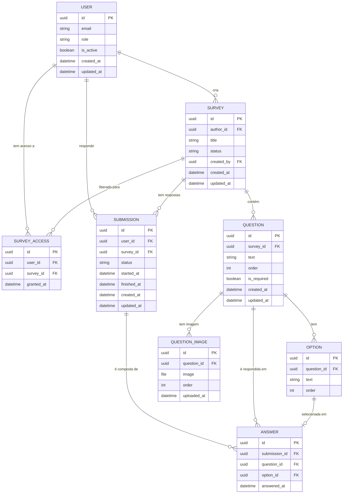

```mermaid
erDiagram
    USER ||--o{ SURVEY : "cria"
    USER ||--o{ SURVEY_ACCESS : "tem acesso a"
    SURVEY ||--o{ SURVEY_ACCESS : "liberado para"
    USER ||--o{ SUBMISSION : "responde"
    SURVEY ||--o{ QUESTION : "contém"
    SURVEY ||--o{ SUBMISSION : "tem respostas"
    QUESTION ||--o{ OPTION : "tem"
    QUESTION ||--o{ QUESTION_IMAGE : "tem imagem"
    SUBMISSION ||--o{ ANSWER : "é composta de"
    QUESTION ||--o{ ANSWER : "é respondida em"
    OPTION ||--o| ANSWER : "selecionada em"

    USER {
        uuid id PK
        string email
        string role
        boolean is_active
        datetime created_at
        datetime updated_at
    }

    SURVEY {
        uuid id PK
        uuid author_id FK
        string title
        string status
        uuid created_by FK
        datetime created_at
        datetime updated_at
    }

    SURVEY_ACCESS {
        uuid id PK
        uuid user_id FK
        uuid survey_id FK
        datetime granted_at
    }

    QUESTION {
        uuid id PK
        uuid survey_id FK
        string text
        int order
        boolean is_required
        datetime created_at
        datetime updated_at
    }

    QUESTION_IMAGE {
        uuid id PK
        uuid question_id FK
        file image
        int order
        datetime uploaded_at
    }

    OPTION {
        uuid id PK
        uuid question_id FK
        string text
        int order
    }

    SUBMISSION {
        uuid id PK
        uuid user_id FK
        uuid survey_id FK
        string status
        datetime started_at
        datetime finished_at
        datetime created_at
        datetime updated_at
    }

    ANSWER {
        uuid id PK
        uuid submission_id FK
        uuid question_id FK
        uuid option_id FK
        datetime answered_at
    }
```
